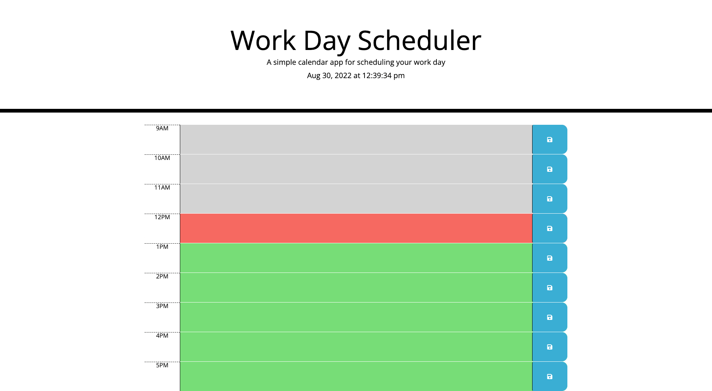

# 05WorkDayScheduler
Create a workday scheduler that will take text and store in local storage with the hour as key. The data will persist on the page even after refresh. There is also a running clock with the current time to colorblock the scheduler with grey for time past, red for current hour, and green for hours coming up. 

## Description
*on page load a blank schedule is presented with 9am-5pm.

*User can fill out the schedule and save using the button to the right of each text field.

*The data is stored using local storage and the time block as key for retrieval.

*Upon refreshing of the page, data is pulled from local storage using the time as key to put them in the correct time slots. 

## Mock-up
The images below shows the webpage created

## Location
https://twangerwang.github.io/05WorkDayScheduler/

## Credits
Original code provided by University of Texas Coding Bootcamp

## License
MIT License

Copyright (c) 2022 Teddy Wang

Permission is hereby granted, free of charge, to any person obtaining a copy
of this software and associated documentation files (the "Software"), to deal
in the Software without restriction, including without limitation the rights
to use, copy, modify, merge, publish, distribute, sublicense, and/or sell
copies of the Software, and to permit persons to whom the Software is
furnished to do so, subject to the following conditions:

The above copyright notice and this permission notice shall be included in all
copies or substantial portions of the Software.

THE SOFTWARE IS PROVIDED "AS IS", WITHOUT WARRANTY OF ANY KIND, EXPRESS OR
IMPLIED, INCLUDING BUT NOT LIMITED TO THE WARRANTIES OF MERCHANTABILITY,
FITNESS FOR A PARTICULAR PURPOSE AND NONINFRINGEMENT. IN NO EVENT SHALL THE
AUTHORS OR COPYRIGHT HOLDERS BE LIABLE FOR ANY CLAIM, DAMAGES OR OTHER
LIABILITY, WHETHER IN AN ACTION OF CONTRACT, TORT OR OTHERWISE, ARISING FROM,
OUT OF OR IN CONNECTION WITH THE SOFTWARE OR THE USE OR OTHER DEALINGS IN THE
SOFTWARE.